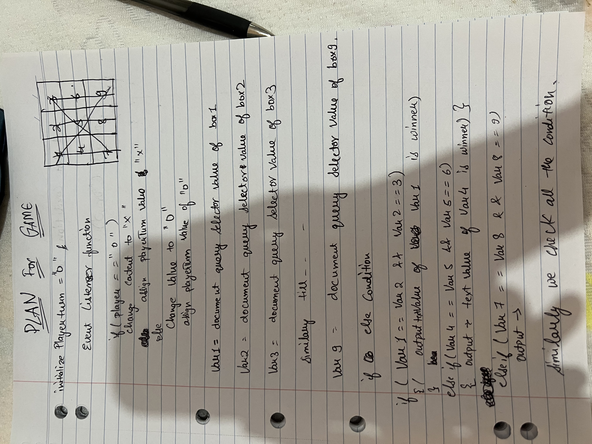
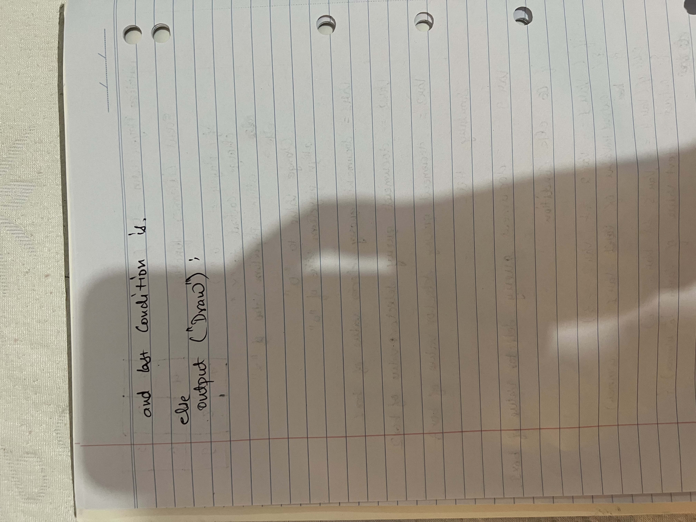

# Tic Tac Toe

<a href="https://sachin281294.github.io/Tic-tac-toe/">Click here to play the Game</a>

<h2>GAME DESCRIPTION</h2>

Tic-tac-toe is a two player game (one of them being your computer program). The two players take turns putting marks on a 3x3 board. The player who first gets 3 of his/her marks in a row (vertically, horizontally, or diagonally) wins the game, and the other loses the game.

<h2>Game Rules</h2>
<h3>A game will consist of a sequence of the following actions:</h3>

1. The player that gets to play with the "X" marks will play first (we call him/her player 1) and the player that gets to play with the "O" marks will play second (we call him/her player 2).

2. The game ends when either.One of the players wins the game, i.e. this player gets three of his/her marks in a row (vertically, horizontally, or diagonally).
all the positions on the board are occupied. In this case, the game ends in a draw.

<h2>Plan</h2>

firstly i will make a html file and then i will make nine empty divs and style them a grid then in 
if playerturn is equal X
change content to x
and then assign playerturn value of O

<h2>Rest is in Plan images below</h2>

